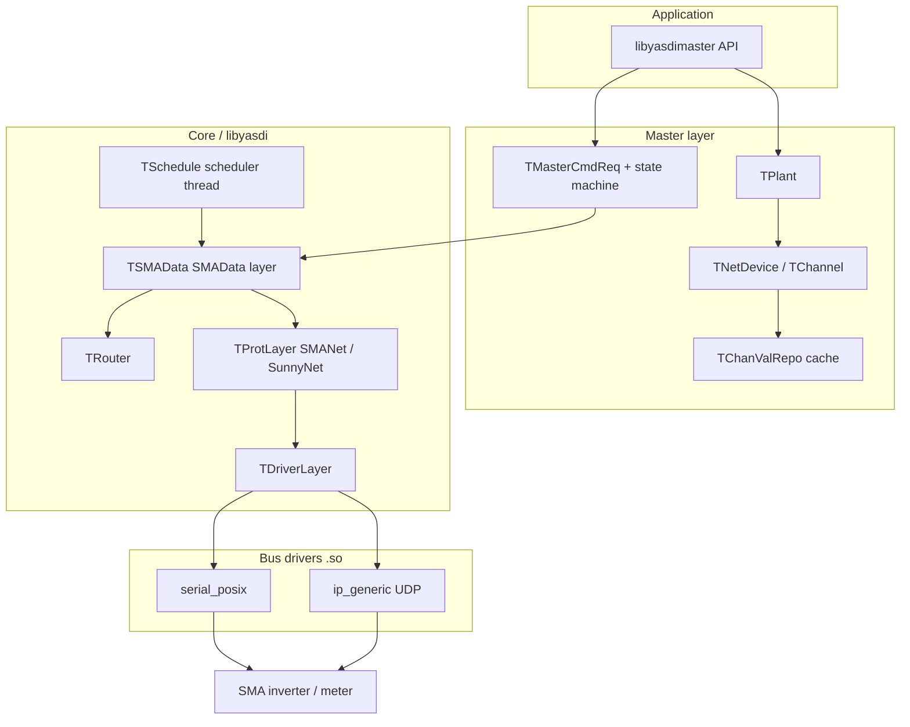

# YASDI architecture (deep reference)

**YASDI** — *(Y)et (A)nother (SMA (D)ata (I)mplementation)* — is SMA Solar Technology’s C library for **master-mode** communication with SMA devices using the **SMAData1** protocol over **SMANet** and **SunnyNet** transports.

Source in this repository: `yasdi/sdk/` (version **1.8.3** per `yasdi/sdk/projects/generic-cmake/CMakeLists.txt`).

License: **GNU LGPL 2.1** (`yasdi/sdk/LICENSE`).

---

## Purpose and scope

YASDI implements:

- Loading **bus drivers** (serial, IP/UDP) as shared libraries
- **Device discovery** on the SMA bus
- Downloading **channel lists** from devices
- Reading and writing **channel values** (parameters, spot/live values, test channels)
- Caching values with **timestamps** and **access levels**

It does **not** provide a GUI. Sample programs (`yasdishell`, `sample1`) demonstrate the API.

Supported platforms (from `yasdi/sdk/README`): Windows, Linux, macOS, Solaris, embedded RTOS ports, etc. Linux uses `os_linux.c` (pthread, standard POSIX I/O).

---

## Binary layout (CMake build)

Built artifacts from `yasdi/sdk/projects/generic-cmake/`:

| Library | Sources (summary) | Depends on |
|---------|-------------------|------------|
| `libyasdi.so` | Core: scheduler, SMAData layer, router, protocol layer, drivers loader, INI repo | OS abstraction |
| `libyasdimaster.so` | Master API, plant, devices, channels, state machines | `libyasdi` |
| `yasdi_drv_serial.so` | `driver/serial_posix.c` (Linux) | `libyasdi` |
| `yasdi_drv_ip.so` | `driver/ip_generic.c` | `libyasdi` |
| `yasdishell` | Demo CLI | `libyasdimaster` |

CMake options (defaults in tree):

- `YASDI_DRIVER_SERIAL` — ON
- `YASDI_DRIVER_IP` — OFF (enable for Ethernet/UDP)
- `YASDI_DEBUG_OUTPUT` — OFF

Applications link **`libyasdimaster`** only; it pulls in **`libyasdi`**. Driver modules are loaded dynamically from names in `yasdi.ini` `[DriverModules]`.

---

## Layered architecture

YASDI uses a **layered stack** (documented implicitly across `core/`, `protocol/`, `driver/`, `master/`):



### Layer responsibilities

| Layer | Key modules | Responsibility |
|-------|-------------|----------------|
| **Application API** | `libs/libyasdimaster.c`, `libyasdimaster.h` | Stable C API: devices, channels, sync/async I/O, events |
| **Master** | `master/plant.c`, `netdevice.c`, `netchannel.c`, `states/*.c`, `mastercmd.c` | Device model, command queue, state pattern per operation |
| **SMAData** | `core/smadata_layer.c` | SMAData1 framing, IO requests, send/receive threads |
| **Routing** | `core/router.c` | Maps SMA network addresses → bus driver + peer |
| **Protocol (L2)** | `core/prot_layer.c`, `protocol/smanet.c`, `protocol/sunnynet.c` | HDLC-style SMANet, SunnyNet encapsulation, checksums |
| **Driver** | `core/driver_layer.c`, `driver/*.c` | Plugin `.so` load, read/write/ioctrl to media |
| **OS** | `os/os_linux.c` | Memory, threads, mutexes, sleep, debug output |
| **Infrastructure** | `core/scheduler.c`, `core/iorequest.c`, `core/timer.c`, `smalib/getini.c`, `core/repository.c` | Tasks, timeouts, INI config |

---

## Initialization and shutdown

### Public entry points

**Master applications** must use:

```c
yasdiMasterInitialize(const char *iniFile, DWORD *pDriverNum);
// ... work ...
yasdiMasterShutdown();
```

Do **not** call `yasdiInitialize()` / `yasdiShutdown()` directly when using the master library — the master wraps them.

### `yasdiInitialize()` (core) — `libs/libyasdi.c`

1. Store INI path (`ProgPath`) for relative paths in config
2. `TRepository_Init()` — load INI into key/value store (`getini.c`)
3. Configure debug output (`Misc.DebugOutput` → stderr/stdout/file)
4. `TSMAData_constructor()` — brings up SMAData layer, scheduler, driver layer, protocol layer
5. Return driver count via `TDriverLayer_GetDriverCount()`
6. `TStatisticWriter_Constructor()` — optional statistics

### `yasdiMasterInitialize()` — `libs/libyasdimaster.c`

After successful `yasdiInitialize()`:

1. `TPlant_Constructor()` — empty PV plant (`TPlant.DevList`)
2. `TSMADataMaster_Constructor()` — master singleton, command queues, timeouts
3. Set `bIsMasterLibInit = true`
4. Read `Misc.checkValueRange` from repository

### Shutdown order (reverse)

`yasdiMasterShutdown()` → tears down plant, master, then `yasdiShutdown()` → SMAData, repository, OS cleanup.

---

## Configuration (`yasdi.ini`)

Windows-INI-style file parsed by `smalib/getini.c` into `TRepository`.

### Sections

| Section | Purpose |
|---------|---------|
| `[DriverModules]` | `Driver0=yasdi_drv_serial`, `Driver1=yasdi_drv_ip`, … |
| `[COMn]` | Serial port: `Device`, `Media`, `Baudrate`, `Protocol` |
| `[IPn]` | UDP peers: `Protocol`, `Device0=ip`, … |
| `[Misc]` | `DebugOutput`, `checkValueRange`, etc. |

Example: `yasdi/sdk/projects/generic-cmake/yasdi-posix.ini`.

Drivers are **dynamic libraries** loaded at startup by name. Each driver registers a `TDevice` vtable (`include/device.h`): `Open`, `Close`, `Read`, `Write`, `IoCtrl`.

---

## Threading and scheduling

YASDI is **multi-threaded on Linux** (`pthread`).

### Scheduler — `core/scheduler.c`

- **`TSchedule_MainExecute`** runs in a dedicated **scheduler thread** (`TSchedule_SchedulerMainThreadLoop`)
- Maintains:
  - **Task list** (`TTask`) — periodic callbacks
  - **Timer list** (`TMinTimer`) — IO request timeouts
- Default poll delay: `YASDI_SCHEDULER_DELAY_TIME` (30 ms) in `os_linux.h`
- SMAData layer registers receive/send work and frame checking (`TSchedule_CheckForRecFrames`)

### SMAData layer threads — `core/smadata_layer.h`

- `TSMAData_ReceiverThreadExecute` — inbound frames from drivers
- `TSMAData_SendThreadExecute` — outbound transmission
- IO requests (`TIORequest`) tie async bus operations to timers and callbacks

**Implication for integrators:** API calls may block waiting for scheduler/IO completion; concurrent calls need care (`YE_TOO_MANY_REQUESTS` for sync overload).

---

## Protocol stack detail

### SMAData1 (network layer)

Defined in `core/smadata_layer.h`:

- Packet header `TSMADataHead`: source/dest address, control, packet counter, command
- Control flags: `ctrlAck`, `ctrlGroup` (broadcast), `ctrlStringFilter`
- High-level `TSMAData` structure with protocol flags (`TS_BROADCAST`, `TS_ANSWER`, `TS_PROT_SMANET_ONLY`, …)
- PPP protocol id constant: `PROT_PPP_SMADATA1 = 0x4041`

`TSMAData_SendPacket()` / `TSMAData_AddIORequest()` are the central transmit/receive primitives.

### Transport protocols (L2) — `core/prot_layer.h`

| ID | Name | Implementation |
|----|------|----------------|
| `PROT_SMANET` (8) | SMANet | `protocol/smanet.c` — HDLC-like framing, FCS |
| `PROT_SUNNYNET` (16) | SunnyNet | `protocol/sunnynet.c` — length/checksum/EOT scanning |

`TProtLayer_WriteFrame()` selects encapsulation based on device/protocol. Devices store `prodID` on `TNetDevice` (`PROT_SMANET` or `PROT_SUNNYNET`).

### Routing — `core/router.c`

- Table of up to **200** routes (`MAX_TAB_ENTRIES`)
- Each `TRouteTabEntry`: SMA **network address** → **bus driver ID** + **driver peer handle**
- Dynamic routes age out after **5 minutes** without use
- `TRouter_DoTxRoute()` picks driver for outbound frames
- Populated during device detection / online sync

---

## Master domain model

### Plant — `master/plant.c`

Singleton **`TPlant Plant`**:

- `DevList` — all discovered `TNetDevice` instances
- `TPlant_AddDevice` / `TPlant_RemDevice` / `TPlant_FindSN`
- `TPlant_CreateChannels` — builds channel objects from downloaded channel list buffers
- `TPlant_StoreChanList` — parses SMA channel list binary into `TChanList`

Represents one **PV installation** from the master’s perspective.

### Device — `master/netdevice.h`

**`TNetDevice`** fields:

| Field | Meaning |
|-------|---------|
| `Handle` | Opaque YASDI device handle (via object manager) |
| `Name`, `Type` | Human name, 8-char device type |
| `SerNr` | Serial number |
| `NetAddr` | SMAData1 network address |
| `ChanList` | All `TChannel` handles for device |
| `chanValRepo` | Cached values (`TChanValRepo`) |
| `prodID` | SMANet vs SunnyNet |

Subclasses: `TNetSWR` (inverter), `TNetSBC` (data logger with sub-devices).

### Channel — `master/netchannel.h`

**`TChannel`** (metadata from device channel list):

| Field | SMAData meaning |
|-------|-----------------|
| `wCType` | Channel type |
| `wNType` | Data format / array depth |
| `wLevel` | Access level visibility |
| `Name` | e.g. `"Pac"`, `"TotWh"` |
| `CUnit` | Unit string |
| `bCIndex` | Channel index |
| `fGain`, `fOffset` | Scaling |
| `StatText` | Enumerated status text mappings |

Values live in **`TChanValRepo`**, not inside `TChannel`.

### Channel value cache — `master/chanvalrepo.h`

Per device:

- **`TMap`** — channel handle → offset in byte block
- **`chanvalueblock`** — packed raw values
- Validity flagged in handle bit 31
- Separate timestamps for online / parameter / test channel groups

API reads consult cache age (`GetChannelValue` **`dMaxChanValAge`**) before issuing bus traffic.

### Object handles — `master/objman.c`

**`TObjManager`** maps `TObjectHandle` (DWORD) → C object pointer. `INVALID_HANDLE = 0`.

All API `DWORD` device/channel handles go through this indirection.

---

## Master commands and state machine

### Command types — `master/mastercmd.h`

| Command | Purpose |
|---------|---------|
| `MC_DETECTION` | Search for devices on bus |
| `MC_GET_PARAMCHANNELS` | Read parameter channels |
| `MC_GET_SPOTCHANNELS` | Read spot/live channels |
| `MC_GET_TESTCHANNELS` | Read test channels |
| `MC_SET_PARAMCHANNEL` | Write parameter |
| `MC_REMOVE_DEVICE` | Drop device from plant |
| `MC_GET_BIN_INFO` / `MC_GET_BIN` | Binary info areas |
| `MC_RESET` | Full master reset |

Each command is a **`TMasterCmdReq`**:

- `CmdType`, `Result` (`MCS_SUCCESS`, `MCS_TIMEOUT`, …)
- **`State`** — pointer to current **`TMasterState`** (state pattern)
- **`IOReq`** — linked bus transaction

Queues on **`TSMADataMaster`**:

- `MasterCmdQueue` — pending commands
- `WorkingCmdQueue` — in-flight commands
- Limits: `iMaxCountOfMCinProgress` parallel commands

### Master states — `master/states.h`

| State ID | Handler | Typical use |
|----------|---------|-------------|
| `MASTER_STATE_INIT` | `TStateInit` | Startup |
| `MASTER_STATE_DETECTION` | `TStateDetect` | Device scan |
| `MASTER_STATE_CONFIGURATION` | (config) | Channel list download |
| `MASTER_STATE_IDENTIFICATION` | `TStateIdent` | Identify devices |
| `MASTER_STATE_CONTROLLER` | `TStateController` | General control |
| `MASTER_STATE_CHANREADER` | `TStateChanReader` | Read channel values |
| `MASTER_STATE_CHANWRITER` | `TStateChanWriter` | Write channel values |

Each state implements:

- `OnEnter`, `OnIOReqPktRcv`, `OnIOReqEnd`, `GetStateIndex`

Detection fires API events (`YASDI_EVENT_DEVICE_ADDED`, `YASDI_EVENT_DOWNLOAD_CHANLIST`, …) via `TSMADataMaster_FireAPIEventDeviceDetection`.

---

## IO request lifecycle — `core/iorequest.h`

**`TIORequest`** represents one bus transaction:

| Field / concept | Role |
|-----------------|------|
| `TReqStatus` | `RS_WORKING`, `RS_SUCCESS`, `RS_TIMEOUT`, `RS_QUEUED` |
| `TReqType` | `RT_MONORCV`, `RT_MULTIRCV`, `RT_NORCV` |
| `TMinTimer` | Response timeout |
| Callbacks | `OnReceive`, `OnEnd`, `OnTransfer`, `OnStarting` |

Master states attach IO requests; SMAData layer sends frames and invokes callbacks when responses arrive or timers expire.

---

## Public master API (summary)

Full declarations: `yasdi/sdk/libs/libyasdimaster.h`.

### Lifecycle

| Function | Notes |
|----------|-------|
| `yasdiMasterInitialize` | First call; loads INI and drivers |
| `yasdiMasterShutdown` | Required cleanup |
| `yasdiReset` | Full reset to post-load state |
| `yasdiMasterGetVersion` | Major/minor/release/build |

### Drivers

| Function | Notes |
|----------|-------|
| `yasdiMasterGetDriver` / `yasdiMasterSetDriverOnline` / `yasdiMasterSetDriverOffline` | Wrappers around core driver API |
| `yasdiMasterGetDriverName` | Human-readable driver name |
| `yasdiMasterDoDriverIoCtrl` | Driver-specific commands |

### Devices

| Function | Notes |
|----------|-------|
| `DoStartDeviceDetection(count, wait)` | Scan bus; blocking if `wait` TRUE |
| `DoStopDeviceDetection` | Abort scan |
| `GetDeviceHandles` | List devices in plant |
| `FindDeviceSN` | Lookup by serial |
| `GetDeviceName`, `GetDeviceType`, `GetDeviceSN` | Metadata |
| `RemoveDevice` | Remove from plant |

### Channels

| Function | Notes |
|----------|-------|
| `GetChannelHandles` / `GetChannelHandlesEx` | List/filter by `SPOTCHANNELS`, `PARAMCHANNELS`, … |
| `FindChannelName` | Lookup by SMA name string |
| `GetChannelName`, `GetChannelUnit`, `GetChannelValRange` | Metadata |
| `GetChannelAccessRights` | `CAR_READ` / `CAR_WRITE` vs current access level |
| `GetChannelValue` | **Blocking** read with max age |
| `GetChannelValueAsync` | Non-blocking request |
| `SetChannelValue` / `SetChannelValueAsync` / `SetChannelValueString` | Writes |
| `GetChannelValueTimeStamp` | Unix time of cached sample |
| `GetChannelArraySize` | Multi-value channels |

### Events

| Event | Callback signature |
|-------|-------------------|
| `YASDI_EVENT_DEVICE_DETECTION` | `(TYASDIDetectionSub, deviceHandle, param)` |
| `YASDI_EVENT_CHANNEL_NEW_VALUE` | `(chanHandle, devHandle, value, text, err)` |
| `YASDI_EVENT_CHANNEL_VALUE_SET` | (write completion) |

Register with `yasdiMasterAddEventListener` / `yasdiMasterRemEventListener`.

### Security / access level — `master/ysecurity.c`

`yasdiMasterSetAccessLevel(user, passwd)` sets visibility:

- Users include `"user"`, `"inst"`, `"sma"` (passwords obfuscated in source)
- Channels filtered by `TChannel.wLevel` vs current `TLevel`

Higher levels expose more parameter channels.

### Error codes (`YE_*`)

| Code | Meaning |
|------|---------|
| `YE_OK` (0) | Success |
| `YE_UNKNOWN_HANDLE` | Bad device/channel handle |
| `YE_SHUTDOWN` | Library shutting down |
| `YE_TIMEOUT` | Device did not respond |
| `YE_VALUE_NOT_VALID` | Cached value invalid |
| `YE_NO_ACCESS_RIGHTS` | Access level too low |
| `YE_TOO_MANY_REQUESTS` | Sync API overload |

---

## Typical runtime sequences

### 1. Minimal read (from `sample1.c`)

```
yasdiMasterInitialize(ini, &nDrivers)
for each driver: yasdiMasterSetDriverOnline(i)
DoStartDeviceDetection(1, TRUE)
GetDeviceHandles(handles, max)
FindChannelName(handles[0], "Pac")
GetChannelValue(chan, dev, &value, text, textSize, maxAgeSec)
yasdiMasterShutdown()
```

### 2. Interactive exploration (`yasdishell`)

Same init, plus event listener for hot-plug detection, shell commands to list channels and read/write values, access level changes.

### 3. Cached read semantics

`GetChannelValue(..., maxAgeSec)`:

- If cache younger than `maxAgeSec` → return cached value (no bus traffic)
- Else → master schedules `MC_GET_*` / channel reader state → blocking until fresh value or timeout

Setting `maxAgeSec = 0` forces refresh **every call** (documented as very expensive).

---

## Source tree map

```
yasdi/sdk/
  libs/           libyasdi.c, libyasdimaster.c — public API implementations
  include/        os.h, device.h, debug.h, packet.h, compiler.h
  smalib/         getini.c, smadef.h — INI + SMA types
  core/           scheduler, smadata_layer, router, prot_layer, iorequest, timer, mempool
  protocol/       smanet.c, sunnynet.c — L2 framing
  driver/         serial_posix.c, ip_generic.c — bus driver plugins
  master/         plant, netdevice, netchannel, states, mastercmd, chanvalrepo, objman, ysecurity
  os/             os_linux.c, os_windows.c — portability
  shell/          CommonShellUIMain.c — yasdishell demo
  samples/        sample1.c
  projects/generic-cmake/  CMake build + yasdi-posix.ini
```

---

## Design patterns used

| Pattern | Where |
|---------|-------|
| **Singleton** | `TPlant`, `TSMADataMaster`, scheduler |
| **State** | `TMasterState` per command phase |
| **Object handles** | `TObjManager` hides pointers from API |
| **Plugin drivers** | `TDriverLayer` + dynamic `.so` |
| **Delegation** | `TDeviceList`, `TChanList` wrap `THandleList` |
| **Observer** | API event listeners, frame listeners |
| **C “classes”** | Struct + function pointers (`TNetDevice`, `TDevice`) |

---

## Limits and caveats

1. **Age of codebase** — API and comments reflect 2001–2009 SMA era; some functions marked **DEPRECATED** in `libyasdimaster.h`.
2. **INI configuration** — not YAML; paths relative to INI file location.
3. **Blocking API** — sync reads/writes block calling thread.
4. **No TLS** — bus security is physical/access-level based, not encryption.
5. **Driver CMake defaults** — IP driver off by default; must enable for UDP Ethernet inverters.
6. **Concurrent master** — only one logical plant per process (`TPlant` singleton).

---

## Relationship to supla-device

| Aspect | YASDI | supla-device / sd4linux |
|--------|-------|---------------------------|
| Protocol | SMAData / SMANet / SunnyNet | SUPLA SRPC over TLS |
| Config | `yasdi.ini` | `supla-device.yaml` |
| Values | SMA channel names (`Pac`, …) | SUPLA channel types/functions |
| Threading | Internal pthread + blocking API | `SuplaDevice.iterate()` main loop |
| Integration | See [integration plan](yasdi-supla-device-plan.md) | Parsed channels, extensions, or sidecar |

---

## Further reading

- SMAData1 specification (external to this repo) — channel type/index/level semantics
- `yasdi/sdk/CHANGES` — version history
- `yasdi/sdk/driver/README` — driver module list
- [Integration plan](yasdi-supla-device-plan.md) — Option A–D for sd4linux
