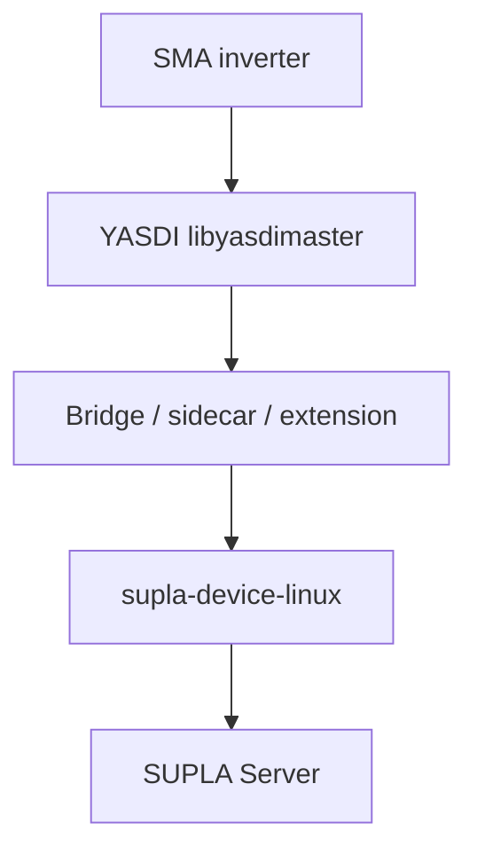

# YASDI ↔ supla-device integration plan

This document describes all practical ways to connect **YASDI** (SMA inverter communication) with **sd4linux** (`supla-device-linux`) in this repository.

Related reading:

- [YASDI architecture](yasdi-architecture.md) — internal design of the YASDI library
- [Quickstart: sd4linux](../quickstart/sd4linux.md) — building and running the Linux SUPLA device
- [extras/examples/linux/README.md](../../extras/examples/linux/README.md) — YAML channel reference

---

## Context

| Component | Location | Role |
|-----------|----------|------|
| **YASDI** | `yasdi/` (v1.8.3) | LGPL library; SMAData master over serial (SMANet) or UDP (SMANet/SunnyNet) |
| **supla-device core** | `src/` | SUPLA protocol, Elements, Channels |
| **sd4linux** | `extras/examples/linux/`, `extras/porting/linux/` | YAML-configured Linux runtime |

**Today:** supla-device has PV integrations for **Fronius**, **SolarEdge**, and **Afore** (HTTP/API). There is **no** built-in SMA/YASDI channel type.

**Goal:** Expose SMA inverter measurements (and optionally controls) as SUPLA channels visible in SUPLA Cloud / mobile apps.

---

## Integration options overview



| Option | Complexity | Code changes | Best for |
|--------|------------|--------------|----------|
| **A — Cmd bridge** | Low | None in supla-device | Discovery, one-off values |
| **B — File/MQTT sidecar** | Medium | Small helper only | Production without linking YASDI into sd4linux |
| **C — sd4linux extension** | High | Extension + CMake | Single process, YAML-native SMA channel |
| **D — Core `Supla::PV::Sma`** | Highest | Upstream feature | Long-term maintained SMA support |

---

## Option A — Shell/Cmd bridge (zero sd4linux changes)

### Idea

Run a small program that uses YASDI and prints values to stdout or a file. Configure sd4linux **Parsed** channels with `source: Cmd` or `source: File`.

```
SMA ──YASDI──► yasdi-read.sh ──stdout──► ThermometerParsed / ElectricityMeterParsed
```

### Steps

1. Build YASDI (`yasdi/sdk/projects/generic-cmake`).
2. Configure `yasdi.ini` (serial or IP driver).
3. Write helper (C or script wrapping `sample1` / custom binary):
   - init YASDI once per invocation **or** accept slow startup each poll
   - `FindChannelName(dev, "Pac")` → print value
4. Add sd4linux YAML, e.g.:

```yaml
channels:
  - type: GeneralPurposeMeasurementParsed
    value: 0
    multiplier: 1
    source:
      type: Cmd
      command: "/usr/local/bin/yasdi-read Pac"
    parser:
      type: Simple
      refresh_time_ms: 15000
```

For multiple fields, emit JSON and use `ElectricityMeterParsed` + `parser: Json`.

### Pros

- No changes to supla-device
- Fast to validate SUPLA Cloud channel functions
- Isolates YASDI crashes from sd4linux

### Cons

- `Cmd` source uses `popen()` every refresh — YASDI init/teardown per poll is expensive unless helper is trivial
- Weak error/offline semantics
- No shared YASDI cache across channels

### When to choose

Proof of concept, channel name discovery, temporary setups.

---

## Option B — Long-lived sidecar + File or MQTT source

### Idea

Dedicated daemon initializes YASDI **once**, polls channels on a timer, writes state to a file or MQTT topic. sd4linux uses existing Parsed channel types — no YASDI linkage in `supla-device-linux`.

```
SMA ──YASDI──► yasdi-bridge (daemon) ──► /run/yasdi/state.json
                                              │
                                              ▼
                                    ElectricityMeterParsed (File + Json)
                                              │
                                              ▼
                                    supla-device-linux ──► SUPLA Cloud
```

### Sidecar responsibilities

- `yasdiMasterInitialize`, drivers online, `DoStartDeviceDetection`
- Periodic `GetChannelValue` / `GetChannelValueAsync` for configured channel names
- Write JSON snapshot with timestamps and validity flags
- Handle reconnect, access level (`yasdiMasterSetAccessLevel`), logging

Example JSON shape:

```json
{
  "updated_at": 1717843200,
  "device_sn": 12345678,
  "online": true,
  "pac_w": 1523.4,
  "totwh_kwh": 12345.6,
  "uac_v": 230.1
}
```

Example sd4linux fragment:

```yaml
channels:
  - type: ElectricityMeterParsed
    parser:
      type: Json
      refresh_time_ms: 5000
    source:
      type: File
      file: /run/yasdi/state.json
      expiration_time_sec: 120
    phase_1:
      - power_active: pac_w
        multiplier: 1
```

Optional: publish the same JSON to MQTT and use `source: MQTT` (already supported).

### Deployment

- systemd: `yasdi-bridge.service` + `supla-device.service`
- Docker: sidecar container + sd4linux container sharing a volume

### Pros

- Clean separation; blocking YASDI calls stay out of `SuplaDevice.iterate()`
- Reuse all existing Parsed channel YAML
- Easier to restart sd4linux without touching inverter bus
- Matches how other integrations often work (external collector → file/MQTT)

### Cons

- Two services to monitor
- Slight latency (file/MQTT poll interval)
- Duplicate config (channel map in sidecar + sd4linux YAML)

### When to choose

**Recommended default for production** until a native extension exists.

---

## Option C — sd4linux extension

### Implemented: minimal native SMA client (no libyasdi)

A read-only SMA RS485 extension ships in this repository:

- Code: `extras/porting/linux/sma/`, extension `extras/porting/linux/extensions/sma/`
- YAML type: `SmaInverter`
- Build: `cmake .. -DSUPLA_LINUX_EXTENSION_DIRS=../../../porting/linux/extensions/sma`
- Docs: [extras/porting/linux/sma/README.md](../../extras/porting/linux/sma/README.md)
- Example: [extras/examples/linux/supla-device-sma.yaml](../../extras/examples/linux/supla-device-sma.yaml)

Channel metadata (`ctype`, `cindex`, `gain`, `offset`) must be profiled once with
`yasdishell` (YASDI used only as a reference tool, not a runtime dependency).

### Alternative: extension linked to YASDI

Add a plugin under `extras/porting/linux/extensions/yasdi/` using the same mechanism as `sos_binary`:

- `supla_linux_extension.cmake` registers sources and `initYasdiExtension`
- `ChannelFactoryRegistry` registers YAML type e.g. `SmaInverter`
- C++ Element extends `Supla::Sensor::ElectricityMeter` (mirror `Supla::PV::Fronius`)

Build:

```bash
cd extras/examples/linux/build
cmake .. -DSUPLA_LINUX_EXTENSION_DIRS=../../../porting/linux/extensions/yasdi
make
```

### Suggested layout

```
extras/porting/linux/extensions/yasdi/
  supla_linux_extension.cmake
  yasdi_manager.{h,cpp}      # singleton: init, shutdown, device lookup, cached reads
  sma_inverter.{h,cpp}       # SUPLA Element; iterateAlways() updates meter fields
```

### YAML sketch

```yaml
channels:
  - type: SmaInverter
    yasdi_ini: /etc/yasdi.ini
    device_serial: 12345678    # or omit for first detected device
    refresh_sec: 15
    access_level:
      user: user
      password: user
    map:
      pac: Pac
      total_energy: TotWh
      voltage: Uac
      current: Iac
      frequency: Fac
```

### Implementation notes

1. **Single YASDI instance** — one `YasdiManager` for all `SmaInverter` channels.
2. **Background polling** — do not call blocking `GetChannelValue()` directly from hot `iterateAlways()` without a cache; use a worker thread or async API + events.
3. **Unit scaling** — follow `Fronius` conventions in `src/supla/pv/fronius.cpp` (e.g. power × 100000 for internal representation).
4. **CMake** — link `yasdimaster`, `yasdi`; set `RPATH` or install `.so` drivers next to binary; document `LD_LIBRARY_PATH`.
5. **Offline** — map YASDI errors (`YE_TIMEOUT`, `YE_VALUE_NOT_VALID`) to channel offline / zero values like Fronius does with `invDisabledCounter`.

### Pros

- Single binary, native YAML type
- Shared YASDI session across channels
- Best UX for sd4linux users

### Cons

- LGPL linking and deployment of YASDI `.so` modules
- Threading integration complexity
- Maintenance burden (extension vs upstream)

### When to choose

You want SMA as a first-class sd4linux channel and accept maintaining an extension.

---

## Option D — Upstream `Supla::PV::Sma` in core

Same design as Option C, but merged into the main tree:

- `src/supla/pv/sma.{h,cpp}` — Element implementation
- `addSma()` in `linux_yaml_config.cpp`
- Optional ESP-IDF/Arduino port is **not** applicable (YASDI is desktop/embedded-Linux only)

### Pros

- Discoverable built-in type `Sma` alongside `Fronius`
- CI can compile and test integration

### Cons

- Couples GPL project to LGPL YASDI in default builds (likely behind CMake flag `SUPLA_LINUX_YASDI=ON`)
- Review/ownership by SUPLA maintainers required for upstream merge

### When to choose

SMA support is a committed product feature, not a private fork.

---

## SMA → SUPLA value mapping (all options)

Use SUPLA **electricity meter** or **impulse counter** / **GPM** functions depending on Cloud assignment.

| Typical SMA channel name | Meaning | SUPLA mapping (via `ElectricityMeter`) |
|--------------------------|---------|----------------------------------------|
| `Pac` | AC active power (W) | `power_active` phase 1 |
| `Uac`, `UacL1`… | AC voltage | `voltage` |
| `Iac`, `IacL1`… | AC current | `current` |
| `Fac` | Grid frequency | `frequency` |
| `TotWh`, yield counters | Energy | `rvr_act_energy` or impulse counter |
| Status / event bits | Alarms | `BinaryParsed` or `GeneralPurposeMeasurementParsed` |

Exact names are **model-specific** — discover with `yasdishell` or `GetChannelName` / `GetChannelHandlesEx`.

Reference implementation for scaling: `src/supla/pv/fronius.cpp` (maps vendor fields to `ElectricityMeter` internals).

---

## sd4linux constraints (all options)

1. **Channel order is immutable** after SUPLA registration — append only.
2. **GUID/AUTHKEY** — `state_files_path` must be writable.
3. **Blocking I/O** — avoid stalling `SuplaDevice.iterate()` (SUPLA keepalive).
4. **License** — YASDI LGPL 2.1 + supla-device GPL v2: dynamic linking is OK; document YASDI source availability if distributing.

---

## Recommended phased rollout

| Phase | Deliverable | Option |
|-------|-------------|--------|
| 1 | Build YASDI, configure `yasdi.ini`, run `yasdishell`, list channels | — |
| 2 | Minimal `yasdi-read` CLI; one Parsed channel in YAML | A |
| 3 | `yasdi-bridge` daemon + `ElectricityMeterParsed` | B |
| 4 | Optional `SmaInverter` extension or upstream `Sma` type | C or D |

---

## Decision matrix

| Criterion | A Cmd | B Sidecar | C Extension | D Core |
|-----------|-------|-----------|-------------|--------|
| Time to first value | Hours | Days | Weeks | Weeks+ |
| Operational robustness | Low | High | High | High |
| sd4linux code changes | None | None | Extension only | Core + Linux port |
| Multi-channel efficiency | Poor | Good | Best | Best |
| SUPLA iterate() safety | OK | OK | Needs design | Needs design |

---

## Open questions before implementation

1. Physical link: RS485 serial, SMA Ethernet (UDP), or both?
2. Inverter model(s) and required SUPLA functions (meter vs production counter vs power only)?
3. Single inverter or multi-device plant?
4. Accept two systemd services (Option B) vs single binary (Option C)?
5. Upstream contribution desired (Option D)?

---

## References in this repository

| Path | Content |
|------|---------|
| `yasdi/sdk/README` | Build instructions |
| `yasdi/sdk/libs/libyasdimaster.h` | Public master API |
| `yasdi/sdk/samples/sample1/sample1.c` | Minimal read example |
| `extras/porting/linux/extensions/sos_binary/` | Extension template |
| `extras/porting/linux/extensions/sma/` | Minimal SMA RS485 `SmaInverter` extension |
| `extras/porting/linux/sma/` | SMANet / SMAData client implementation |
| `src/supla/pv/fronius.{h,cpp}` | PV → `ElectricityMeter` reference |
| `extras/porting/linux/linux_channel_factory.h` | Extension registry API |
